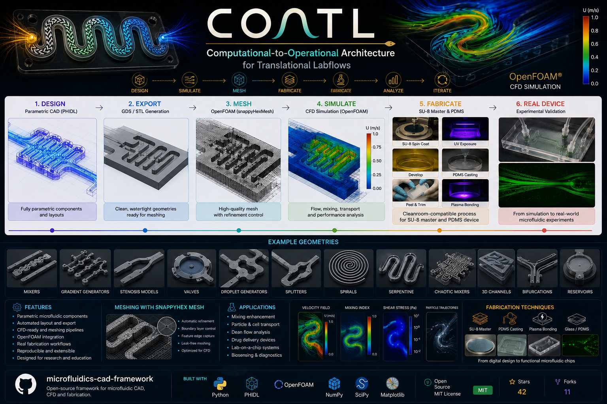

# COATL

<p align="center">
  
</p>

### Computational-to-Operational Architecture for Translational Labflows

COATL is a computational-to-operational framework for the design, simulation, and fabrication of microfluidic systems for biomedical and translational applications.

The project integrates:

- Parametric microfluidic CAD generation
- CFD preprocessing and simulation workflows
- Geometry automation pipelines
- Translational fabrication workflows
- Computational-to-physical device integration

---

# Vision

COATL was created to bridge the gap between:

```text
Computational Design → Physical Realization
```

The framework aims to connect:
- geometry
- flow
- simulation
- fabrication
- and operational laboratory systems

within a unified engineering workflow.

---

# Why COATL?

*Coatl* means *serpent* in Náhuatl, an Indigenous language of Mexico.

The name emerged naturally from the geometry of microfluidic systems themselves:
most channels evolve into serpentine, spiral, adaptive flow paths.

Flow behaves like a serpent:
it bends, adapts, transforms, and finds pathways through complexity.

COATL reflects both:
- the physical nature of fluid transport
- and the transformation from computational concepts into operational systems.

---

# Core Components

## Parametric CAD Generation
- PHIDL-based microfluidic design
- Herringbone generators
- Serpentine and Dean-flow geometries
- Modular channel architectures

## CFD Workflows
- OpenFOAM preprocessing
- STL generation pipelines
- snappyHexMesh workflows
- Automated case preparation

## Fabrication Integration
- SU-8 master preparation
- PDMS fabrication workflows
- Translational microdevice prototyping

---

# Example Workflow

```text
PHIDL → GDS → STL → Mesh → CFD → Fabrication → Device
```

---

# Example Applications

- Microfluidic mixing
- Biomedical diagnostics
- Drug development platforms
- Cell transport systems
- Translational lab-on-chip technologies
- Flow-based biomedical instrumentation

---

# Current Status

COATL is under active development as an evolving computational-to-operational engineering framework.

This public repository contains selected visual demonstrations, concepts, and workflow examples from the broader platform.

---

# Author

Dr Francisco Tovar  
Biomedical Engineering • CFD • Microfluidics • Translational Systems Engineering • Instrumentation

Adjunct Senior Research Fellow. Department of Diabetes, School of Translational Medicine, Faculty of Medicine Nursing and Health Sciences. Monash University.

RMIT University — Melbourne, Australia
Senior
